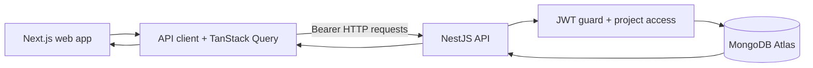
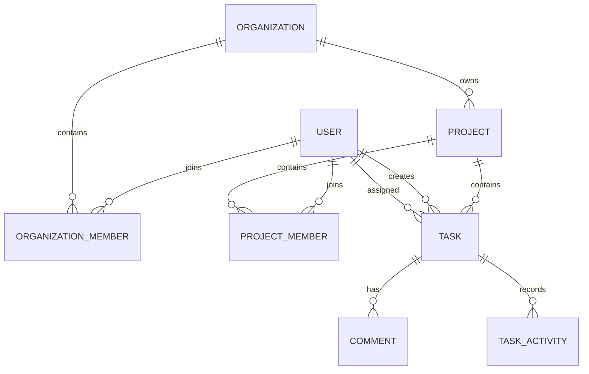

# ProjectFlow

<p align="center">
  <strong>A focused workspace for teams to plan projects, manage tasks, and keep delivery conversations together.</strong>
</p>

<p align="center">
  <a href="https://nextjs.org/"></a>
  <a href="https://nestjs.com/"></a>
  <a href="https://www.mongodb.com/atlas"></a>
  <a href="https://pnpm.io/workspaces"></a>
  <a href="https://turbo.build/repo"></a>
</p>

ProjectFlow is a full-stack project and task tracker for software teams. It combines a NestJS API, a Next.js App Router web application, MongoDB persistence, and shared TypeScript contracts in one pnpm/Turborepo workspace.

## Product Overview

| Area           | Implemented experience                                                     |
| -------------- | -------------------------------------------------------------------------- |
| Authentication | Register, sign in, JWT sessions, current-user loading, sign out            |
| Organizations  | Organization context with owner, admin, and member roles                   |
| Projects       | Browse projects, create projects, view project details, manage members     |
| Tasks          | Create, edit, delete, filter, change status, assign, and unassign tasks    |
| Collaboration  | Task comments and assignment activity history                              |
| Access control | Project-aware backend authorization for every protected operation          |
| Data layer     | MongoDB/Mongoose schemas, indexes, validation, and seeded development data |

## Architecture



MongoDB is accessed only by the NestJS API. The frontend uses `NEXT_PUBLIC_API_URL`, the shared API client, and TanStack Query; it never contains database credentials or connection code.

### Repository layout

```text
apps/
├── api/                 NestJS API, Mongoose schemas, services, and e2e tests
└── web/                 Next.js App Router application and feature UI
packages/
├── shared/              Shared API response types, enums, and constants
├── eslint-config/       Shared ESLint configuration
└── tsconfig/            Shared TypeScript configurations
```

### Domain model



## API Surface

All routes below are protected by JWT authentication unless noted otherwise.

```text
POST   /auth/register                 Public registration
POST   /auth/login                    Public login
GET    /auth/me                       Current authenticated user

GET    /organizations                 Accessible organizations

GET    /projects                      Accessible projects
POST   /projects                      Create a project
GET    /projects/:projectId           Project details
GET    /projects/:projectId/members   Project members
POST   /projects/:projectId/members   Add a project member

GET    /projects/:projectId/tasks     Paginated task list
POST   /projects/:projectId/tasks     Create a task
GET    /tasks/:taskId                 Task details
PATCH  /tasks/:taskId                 Edit task fields
PATCH  /tasks/:taskId/status          Change task status
PATCH  /tasks/:taskId/assignee        Assign or unassign a task
DELETE /tasks/:taskId                 Delete a task
GET    /tasks/:taskId/activity        Cursor-paginated activity history

GET    /tasks/:taskId/comments        List task comments
POST   /tasks/:taskId/comments        Add a task comment
```

Sensitive rules are enforced in backend services. Organization owners and admins have elevated project access; project managers can manage project work; regular members can update their own permitted task state and assign tasks to themselves. The UI reflects these permissions, but never acts as the security boundary.

## Local Development

### Requirements

- Node.js `20.19+`
- pnpm `10.33.0`
- MongoDB 7+ or a reachable MongoDB Atlas cluster

### Install and configure

```bash
pnpm install
cp .env.example .env
```

Set these values in the root `.env` file for local development:

| Variable              | Purpose                                                      |
| --------------------- | ------------------------------------------------------------ |
| `MONGODB_URI`         | MongoDB connection string                                    |
| `JWT_SECRET`          | JWT signing secret                                           |
| `JWT_EXPIRES_IN`      | Token lifetime, for example `7d`                             |
| `API_PORT`            | API port, default `4732`                                     |
| `WEB_ORIGIN`          | Browser origin allowed by API CORS                           |
| `NEXT_PUBLIC_API_URL` | API URL used by the browser, default `http://localhost:4732` |

Never commit real credentials. Production values belong in Railway and Vercel environment settings.

### Run the workspace

```bash
pnpm dev
```

| Application | URL                     |
| ----------- | ----------------------- |
| Web         | `http://localhost:3742` |
| API         | `http://localhost:4732` |

Load repeatable development data with:

```bash
pnpm seed
```

The seed command resets the ProjectFlow collections and creates organizations, users, projects, tasks, and comments for local use.

## Quality Checks

```bash
pnpm install --frozen-lockfile
pnpm exec turbo build --filter=api
pnpm typecheck
pnpm lint
pnpm test
```

The API e2e suite uses `mongodb-memory-server` and covers authentication, projects, tasks, comments, authorization, assignment, activity, and task numbering behavior.

## Deployment

### Backend: Railway

The repository deploys the API with the root `Dockerfile` and [railway.json](railway.json). The image activates pnpm `10.33.0`, installs with the frozen lockfile, builds only the API through Turborepo, and starts the existing API production script.

Configure these Railway variables:

```text
MONGODB_URI=<MongoDB Atlas connection string>
JWT_SECRET=<long random secret>
JWT_EXPIRES_IN=7d
WEB_ORIGIN=https://<your-vercel-app>.vercel.app
```

The API must listen on Railway's injected `PORT` value in production. Do not put database credentials or JWT secrets in the Dockerfile.

### Frontend: Vercel

Set the web application's public API URL to the deployed Railway service:

```text
NEXT_PUBLIC_API_URL=https://<your-api>.railway.app
```

The browser then follows this path:

```text
Vercel Next.js app
    → NEXT_PUBLIC_API_URL
    → Railway NestJS API
    → MongoDB Atlas
```

## Development Accounts

The seed data includes these local-only accounts. They all use `Password123!`.

| Account               | Role/context                            |
| --------------------- | --------------------------------------- |
| `ammar@example.com`   | Organization owner                      |
| `sarah@example.com`   | Organization admin                      |
| `ahmed@example.com`   | Project manager on `ENG`                |
| `magd@example.com`    | Member of `ENG` and `WEB`               |
| `outside@example.com` | Authenticated user with no organization |

Do not use these credentials in production.

## Roadmap

The current implementation delivers the core product workflow. With additional time, the next improvements would be:

1. Refine the frontend visual system further with richer responsive states, stronger accessibility coverage, keyboard-first workflows, and more polished task-board interactions.
2. Add an opt-in AI assistant behind the NestJS API for task summarization, suggested task breakdowns, comment drafting, and project-status insights.
3. Add provider abstraction, authorization, rate limiting, auditability, and cost controls before exposing any AI capability to production users.

AI integration is intentionally future work. It is not currently connected, and no AI credentials or provider calls are present in the frontend.

## License

This repository is an assessment project. Add the project's intended license before distributing it publicly.
